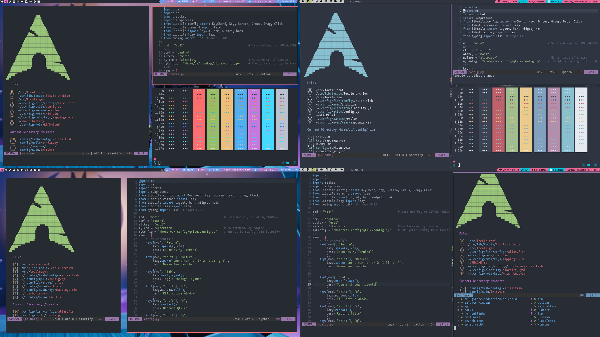
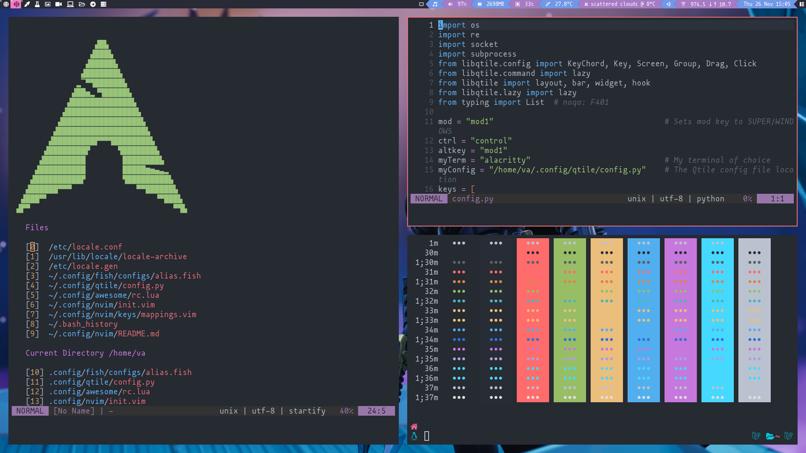
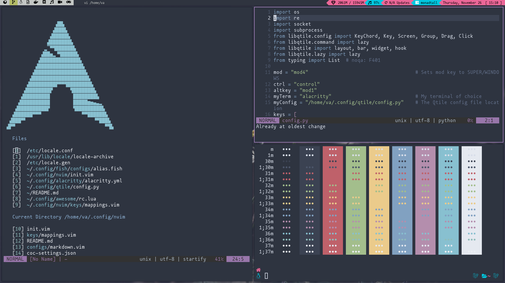
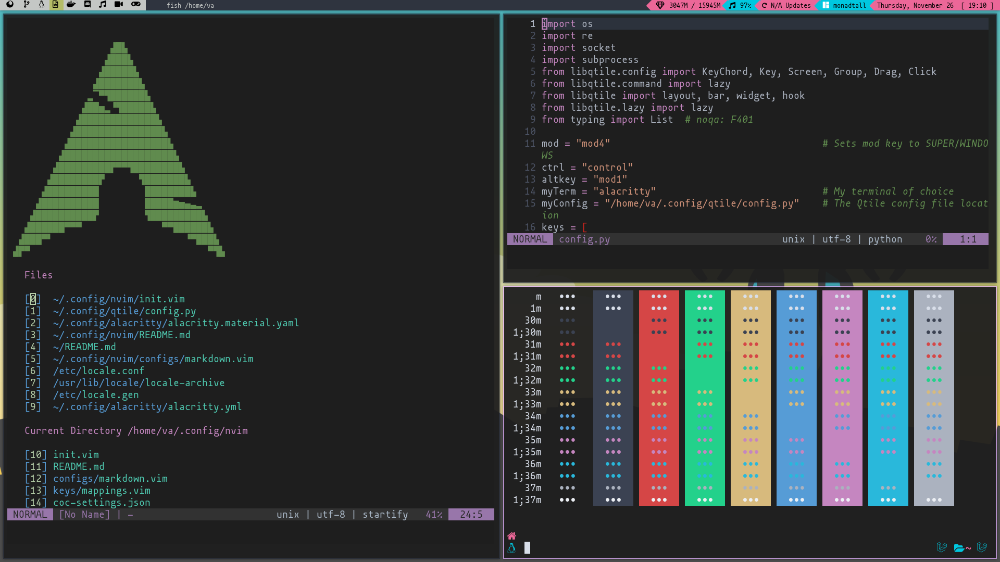

<div align="center">
  <h1><i><b>Doom Nvim</b></i></h1>
</div>


###

<div align="center">

</div>

<br> </br>

<center>


</center>

## Doom NVim like VsCode  




--- 


<br>

<details>
<summary> <font size="5"><i><b>Themes</b></i> </font>🔥🔥🔥 </summary>

<details>


 <summary> • ONE DARK </summary>


</details>

<details>
 <summary> • NORD </summary>


</details>

<details>
 <summary> • VS CODE DARK+ </summary>


</details>

<details>
 <summary> • MATERIAL </summary>


</details>
</details>

---

## _Install Neovim Nightly_

- **Mac**

  ```
  brew install --HEAD neovim # Nightly version

  brew upgrade neovim --fetch-HEAD # update to not to get 🚨 :) 
  ```

- **Ubuntu And Debain Based Distros**

  ```
  curl -l https://github.com/neovim/neovim/releases/download/nightly/nvim.appimage > /tmp/nvim.appimage

  sudo mv /tmp/nvim.appimage /usr/local/bin/nvim

  chmod +x /usr/local/bin/nvim
  ```

- **Arch**

  ```
  yay -S neovim-nightly-git # Git Version to be on 🩸 Edge
  ```
