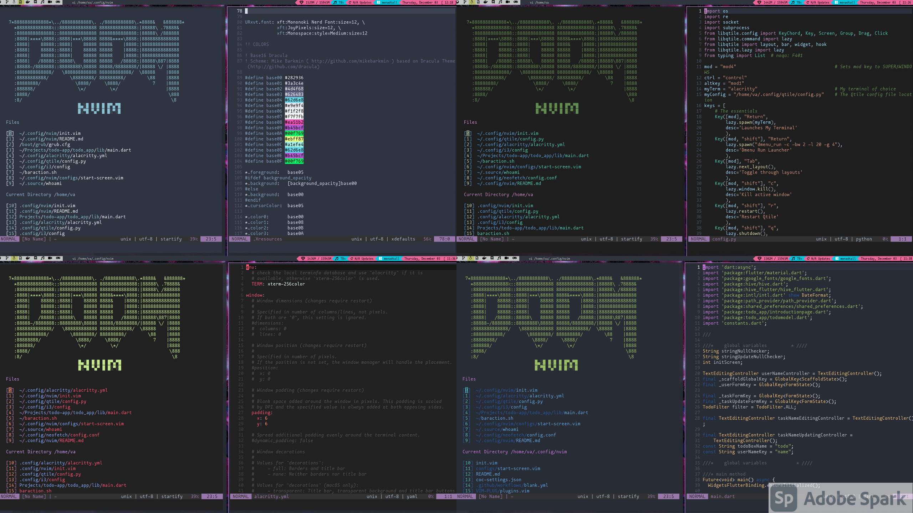

  <h1><i><b>Doom Nvim</b></i></h1>

###

   

---

### Table of Contents
- [Introduction](#introduction)
- [Features](#features)
- [Prerequisites](#prerequisites)
- [Install](#install)
- [Roadmap](#roadmap)
- [Getting help](#getting-help)
- [Contribute](#contribute)

# Introduction

> People Who Are Afraid or Don't Know How to to Configure Vim and get it working without any Hassle. Doom Nvim Gives you Performance and Experience out of the BOX.

Doom Nvim is A Highly Configured Distribution of Neovim. That Delievers the experience and Performance Like a Highly Configured Editor Like VS Code We have A great packing system. It has the Syntax Highlighting and Compiler Prebuilt in for Every Programming Language. Doom Nvim is like A full Fleged IDE (Integrated Development Enviroment) 

**_Doom Nvim is Design in this Criteria:_**

